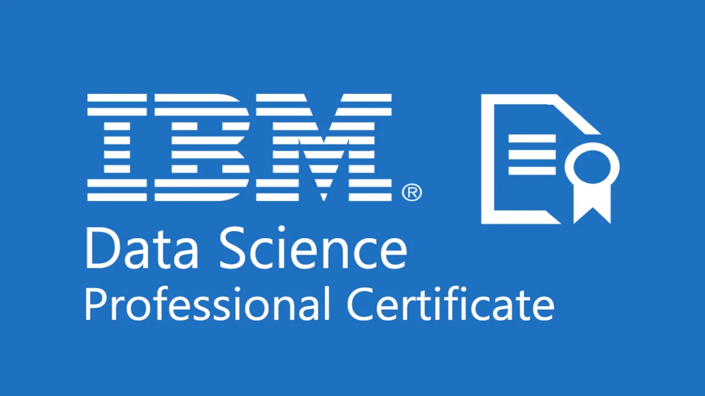

# IBM_Data_Science_Professional_Certificate 
Personal Data Science profesional Certificate course

# Data Science Tools and Ecosystem

In this repo, Data Science Tools and Ecosystem will be summarized.

Several projects in different laguages will be created and updated

### Languages that will be used

Some of the popular languages that Data Scientists use are:

|Language|Why it is used|
|:-:|:-:|
|Python|simplicity, community support, rich ecosystem of libraries and tools, interoperability with other languages, and high-level programming capabilities|
|R|it has static graphics that produce good-quality data visualizations|
|SQL|it allows you to work with structured data stored in databases|